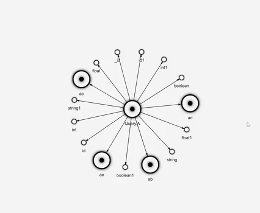

## GraphQL Workspaces

This project exists to develop and experiment with tooling for GraphQL project architecture and workflow.

### Packages
This is a monorepo for all modules created for the GraphQL Workspaces project:

* [@graphql-workspaces/cli](https://github.com/michaeldgraham/graphql-workspaces/tree/main/packages/cli)
* [@graphql-workspaces/load](https://github.com/michaeldgraham/graphql-workspaces/tree/main/packages/load)
### Roadmap

* `@graphql-workspaces/cli`:
  * Command to generate file directory scaffolding to assist creation of new GraphQL type definitions
    * Experiment with user defined `<name>.workspace.graphql` files for providing the semantics of a file directory graph with field names used as command arguments for what to generate at some path
  * Command to remove all printed GraphQL files within a path
  * Watch mode for `printed.graphql` files:
    * Will need to update `@graphql-workspaces/load`:
      * Figure out how to clear the node require cache + prevent cached es imports while using `esm`
      * Keep it working with VSCode auto-save toggled on
      * Keep it working when GraphQL or module import errors are caught
 

* Corresponding VSCode extension
   * Workspace directory graph visualization UI
     * Visualization of GraphQL files
       * Schema files
       * Operations  

