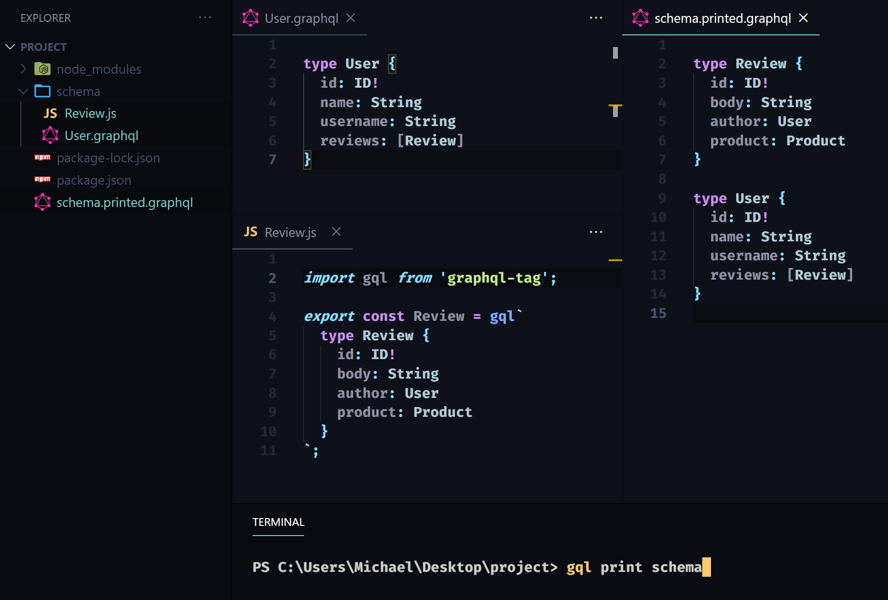

# @graphql-workspaces/cli
A CLI for GQL Workflow.
## Motivation
When a GraphQL schema grows enough to motivate distributing its type definitions into separate files, one might find themselves writing scripts to merge a directory containing them into a single file or variable. The merged schema can then be provided to a server to start and test the API. 

It can also be useful to print the merged schema to a file for inspection, especially to view the results of libraries that transform and augment the merged schema (such as with database language integrations). But this workflow can bring the overhead of updating the paths used in the printing script when wanting to merge and print the contents of only a file or sub-directory.

[GraphQL Tools](https://www.graphql-tools.com/) provides modules for [loading](https://www.graphql-tools.com/docs/schema-merging#file-loading) and [merging](https://www.graphql-tools.com/docs/schema-merging#merging-type-definitions) GraphQL documents and schemas from files (.graphql, .gql, .js and .ts exports) that are very useful for this workflow. To generalize for it, this module uses [@graphql-workspaces/load](https://www.npmjs.com/package/@graphql-workspaces/load), a wrapper over [loadFiles](https://www.graphql-tools.com/docs/api/modules/load-files#loadfiles) and [mergeTypeDefs](https://www.graphql-tools.com/docs/api/modules/merge#mergetypedefs), to support the below cli:
## Install
```
npm install -g @graphql-workspaces/cli
```
## Usage
```
gql [command] [options]
```
### Commands
#### `gql print <path>`
The print command loads and merges the GraphQL contents of file or directory at the provided path and prints the results to a `.printed.graphql` file at the same location.

Both `.graphql` and `.gql` files can be loaded and printed. GraphQL documents exported from `.js` or `.ts` files, as CommonJS or ES modules, are loaded and printed - a common file architecture when using the `gql` template literal available from [graphql-tag](https://www.npmjs.com/package/graphql-tag) or [apollo-server](https://www.npmjs.com/package/apollo-server).

An [executable schema](https://www.graphql-tools.com/docs/generate-schema/) can also be printed, but a version conflict with the [graphql](https://www.npmjs.com/package/graphql) library must be avoided. To do this, install the cli locally and make an npm script, such as `print-generated-schema`, calling `./node_modules/.bin/gql`, with a path to the file exporting the schema. This is useful for printing the executable schema built by libraries that transform and augment the type definitions provided to them, such as those that integrate database languages.

```
Command:
  print <path|p>  Prints the merged GraphQL Documents at the provided path.

Options:
  <path|p>        Required optional argument for path to directory or file.
  -n, --name      Optional argument for file extension prefix (default: <path>.printed.graphql).
```
### Examples
##### Printing a directory
